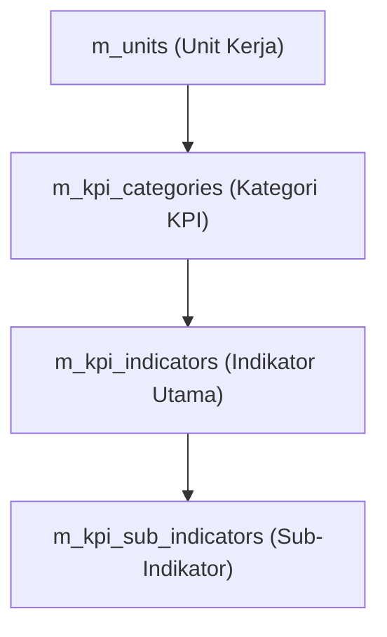

# DOKUMENTASI RESMI RUMUS KALKULASI & SKEMA DATABASE
**Sistem Informasi Jaspel & Remunerasi (JASPEL_Bahar2)**
*Versi Dokumentasi: 1.0 (Baku & Terverifikasi)*

---

## DAFTAR ISI
1. [MODUL /reports (Laporan Remunerasi & Insentif)](#1-modul-reports-laporan-remunerasi--insentif)
   - 1.1. Sumber Data Input
   - 1.2. Rumus Poin Indeks Rupiah (PIR)
   - 1.3. Rumus Skor Indikator & Kategori (P1, P2, P3)
   - 1.4. Rumus Insentif Berbasis Prioritas & Potongan
   - 1.5. Rumus Insentif Bruto & Netto
   - 1.6. Mekanisme Pemotongan Pajak PPh 21
2. [MODUL /kpi-config (Konfigurasi KPI & Indikator)](#2-modul-kpi-config-konfigurasi-kpi--indikator)
   - 2.1. Struktur & Hierarki Database
   - 2.2. Mode Skema KPI Unit (`kpi_schema_mode`)
   - 2.3. Atribut Kategori, Indikator & Sub-Indikator
3. [MODUL /assessment (Penilaian KPI Pegawai)](#3-modul-assessment-penilaian-kpi-pegawai)
   - 3.1. Skema & Integrity Constraint `t_kpi_assessments`
   - 3.2. Perekaman Main Row vs Sub-Row
   - 3.3. Rollup & Sinkronisasi Sub-Indikator Otomatis
   - 3.4. Sinkronisasi Multi-Revenue (`apply_to_umum`) & Fallback Bidireksional
4. [RINGKASAN MATRIX VERIFIKASI](#4-ringkasan-matrix-verifikasi)

---

## 1. MODUL /reports (Laporan Remunerasi & Insentif)

Modul `/reports` bertanggung jawab mengalkulasi distribusi pool pendapatan menjadi insentif bruto, potongan pajak PPh 21, dan insentif netto untuk seluruh pegawai.

### 1.1. Sumber Data Input
- `t_pool`: Menyimpan total pendapatan bersih per periode (`net_pool`, `revenue_bpjs`, `revenue_umum`, `revenue_total`).
- `m_units`: Menyimpan persentase alokasi unit (`proportion_percentage`, `proportion_umum_percentage`, `use_same_proportion`, `kpi_schema_mode`).
- `t_kpi_assessments`: Menyimpan nilai realisasi, bobot, target, dan skor penilaian KPI pegawai.
- `remunerasi_master_dokter`: Menyimpan pagu guarantee fee untuk tenaga medis (dokter).
- `t_settings` (`tax_config`): Menyimpan konfigurasi mekanisme pajak global (`ter`, `final_pp80`, `none`).

### 1.2. Rumus Poin Indeks Rupiah (PIR)
PIR menghitung nilai 1 poin indeks kinerja dalam satuan Rupiah pada suatu unit dan periode tertentu.

#### 1. Net Pool Berdasarkan Jenis Pendapatan (`revenueType`)
- **BPJS**: $NetPool = \text{pool.revenue\_bpjs} \parallel \text{pool.net\_pool}$
- **UMUM**: $NetPool = \text{pool.revenue\_umum} \parallel \text{pool.net\_pool}$
- **ALL**: Mengkalkulasi BPJS dan UMUM secara independen, kemudian menggabungkan insentif per pegawai (`_mergeIncentives`).

#### 2. Alokasi Pool Unit ($AllocatedForUnit$)
$$\text{AllocatedForUnit} = NetPool \times \left( \frac{\text{unitProp}}{100} \right)$$
*Keterangan `unitProp`:*
- Untuk **BPJS**: Menggunakan `proportion_percentage`.
- Untuk **UMUM**: Jika `use_same_proportion !== false`, menggunakan `proportion_percentage`; jika `false`, menggunakan `proportion_umum_percentage`.

#### 3. Formula PIR per Unit
1. **Unit Non-Medis (Standar)**:
   $$\text{remainingPool} = \text{AllocatedForUnit} - \text{totalActivityValueUnit}$$
   $$\text{PIR} = \max\left(0, \, \frac{\text{remainingPool}}{\text{totalSkorUnit}}\right)$$
   *(PIR dibulatkan 2 desimal)*.

2. **Unit Medis (Dokter)**:
   $$\text{totalGuaranteeFee} = \sum \text{pagu\_guarantee\_fee (Dokter di Periode Tersebut)}$$
   $$\text{sisaPaguMedis} = \text{AllocatedForUnit} - \text{totalGuaranteeFee} - \text{totalActivityValueUnit}$$
   $$\text{PIR} = \begin{cases} \frac{\text{sisaPaguMedis}}{\text{totalSkorUnit}} & \text{jika } \text{totalSkorUnit} > 0 \text{ dan } \text{sisaPaguMedis} > 0 \\ 0 & \text{lainnya} \end{cases}$$

---

### 1.3. Rumus Skor Indikator & Kategori (P1, P2, P3)

Setiap pegawai dinilai dalam kategori indikator (umumnya P1, P2, P3).

#### 1. Kategori Terbobot (`is_weighted !== false`)
$$\text{totalRealisasiKategori} = \sum \left( \text{indicatorScore} \times \frac{\text{indWeight}}{100} \right)$$
$$\text{totalTargetKategori} = \sum \left( \text{indTarget} \times \frac{\text{indWeight}}{100} \right)$$
$$\text{kontribusiAkhir} = \frac{\text{totalRealisasiKategori}}{\text{totalTargetKategori}} \times \text{categoryWeight}$$

#### 2. Kategori Tanpa Bobot (`is_weighted === false`)
$$\text{totalRealisasiKategori} = \sum \text{indicatorScore}$$
$$\text{kontribusiAkhir} = \text{totalRealisasiKategori}$$

#### 3. Total Skor Indeks Pegawai ($TotalScore$)
- **Unit Standar**: $\text{indexScore} = \text{kontribusiAkhir}$
- **Unit Medis**: $\text{indexScore} = \text{totalRealisasiKategori}$
- **Total Skor Indeks**:
  $$TotalScore = P1_{score} + P2_{score} + P3_{score}$$
  *(Dibulatkan 2 desimal)*.

---

### 1.4. Rumus Insentif Berbasis Prioritas & Potongan

#### 1. Insentif Prioritas ($totalActivityRupiah$)
Indikator dengan `calculation_method = 'priority'` atau sub-indikator `measurement_type = 'quantitative'`:
$$\text{activityValue} = \text{volume} \times \text{base\_index\_value}$$
*Proteksi Input:* Jika volume dan tariff keduanya diinput > 1000 (Rupiah langsung), $\text{activityValue} = \text{volume}$.

Total Insentif Prioritas Pegawai:
$$totalActivityRupiah = P1_{priority} + P2_{priority} + P3_{priority}$$

#### 2. Potongan Indikator ($totalDeductionRupiah$)
Jika $\text{indicatorScore} < 0$ (misalnya potongan kedisiplinan/kehadiran), nilainya dimasukkan ke $\text{totalDeductionRupiah} = |\text{indicatorScore}|$.

#### 3. Redistribusi Potongan Unit ($meDistribusiPotongan$)
Total potongan seluruh pegawai berdampak pada unit dikumpulkan ($\text{unitTotalDeduction}$). Jumlah potongan ini dibagikan secara merata kepada pegawai di unit tersebut yang **TIDAK MEMILIKI POTONGAN**:
$$\text{meDistribusiPotongan} = \begin{cases} \frac{\text{unitTotalDeduction}}{\text{jumlahPegawaiTanpaPotongan}} & \text{jika } \text{pegawaiTidakAdaPotongan} \\ 0 & \text{jika pegawai memiliki potongan} \end{cases}$$

---

### 1.5. Rumus Insentif Bruto & Netto

#### 1. Insentif Indeks ($indexIncentive$)
$$\text{indexIncentive} = TotalScore \times \text{PIR}$$

#### 2. Insentif Bruto ($grossIncentive$)
$$\text{grossBeforeDeduction} = \text{indexIncentive} + totalActivityRupiah + meDistribusiPotongan + guaranteeFee$$
$$\text{grossIncentive} = \max\left(0, \, \text{grossBeforeDeduction} - totalDeductionRupiah\right)$$

#### 3. Insentif Netto ($netIncentive$)
$$\text{netIncentive} = \text{grossIncentive} - \text{taxAmount}$$

---

### 1.6. Mekanisme Pemotongan Pajak PPh 21

Dihitung via fungsi `calculatePPh21` berdasarkan setting global `tax_config`:

1. **Mekanisme `none` (Tanpa Potongan)**:
   $$\text{taxAmount} = 0 \quad (\text{Tarif } 0\%)$$

2. **Mekanisme `final_pp80` (PP 80/2010 khusus ASN/PNS)**:
   - Status PPPK / BLUD / Non-ASN: $\text{taxAmount} = 0$
   - PNS Golongan IV: $\text{taxAmount} = \text{round}(\text{grossIncentive} \times 15\%)$
   - PNS Golongan III: $\text{taxAmount} = \text{round}(\text{grossIncentive} \times 5\%)$
   - PNS Golongan II & I: $\text{taxAmount} = 0$

3. **Mekanisme `ter` (PP 58/2023 - Default)**:
   - Menentukan **Kategori TER** berdasarkan `tax_status` (PTKP):
     - **Kategori A**: TK/0, TK/1, K/0
     - **Kategori B**: TK/2, TK/3, K/1, K/2
     - **Kategori C**: K/3
   - Menentukan **Tarif TER (%)** dari tabel bracket penghasilan bruto bulanan (`ter-lookup.ts`).
   - Kalkulasi Pajak:
     $$\text{taxAmount} = \text{round}\left( \text{grossIncentive} \times \frac{\text{ratePercentage}}{100} \right)$$

---

## 2. MODUL /kpi-config (Konfigurasi KPI & Indikator)

Modul `/kpi-config` mengelola struktur hirarki dan atribut indikator kinerja.

### 2.1. Struktur & Hierarki Database

### 2.2. Mode Skema KPI Unit (`kpi_schema_mode`)

Disimpan pada kolom `m_units.kpi_schema_mode`:

1. **Mode `'same'` (KPI Sama)**:
   - Unit menggunakan **1 set indikator yang sama** untuk laporan BPJS Kesehatan dan Pendapatan UMUM.
   - `m_kpi_categories.revenue_type` berisi `'all'` atau `NULL`.
   - Data penilaian BPJS Kesehatan otomatis menjadi fallback bila penilaian UMUM belum terisi.

2. **Mode `'different'` (KPI Berbeda)**:
   - Unit memiliki **2 set indikator independen**: satu khusus BPJS (`revenue_type = 'bpjs'`) dan satu khusus UMUM (`revenue_type = 'umum'`).
   - Pengubahan struktur pada BPJS tidak akan merusak skema UMUM dan sebaliknya.

---

### 2.3. Atribut Kategori, Indikator & Sub-Indikator

#### 1. Tabel `m_kpi_categories`
- `category`: Kode kategori (`P1`, `P2`, `P3`, dll.).
- `weight_percentage`: Persentase bobot kategori (misal: P1=60%, P2=30%, P3=10%).
- `is_weighted`: `true` (Kategori Terbobot) / `false` (Kategori Tanpa Bobot / Skor Langsung).
- `configuration_style`: `'index'` (Kinerja ber-target) / `'activity'` (Prioritas ber-tarif).
- `revenue_type`: `'all'`, `'bpjs'`, atau `'umum'`.

#### 2. Tabel `m_kpi_indicators`
- `code`: Kode unik indikator (contoh: `IND-001`).
- `calculation_method`:
  - `'indexing'`: Evaluasi pencapaian target ($\text{Realisasi} / \text{Target} \times 100$).
  - `'priority'`: Evaluasi volume kegiatan ($\text{Volume} \times \text{Base Index Value}$).
- `measurement_type`: `'scoring'` (kualitatif/rating) atau `'quantitative'` (kuantitatif).
- `weight_percentage`: Bobot indikator dalam kategori (Total bobot indikator dalam 1 kategori = 100%).
- `target_value`: Target standar pencapaian (Default = 100).
- `base_index_value`: Nilai indeks dasar atau tarif insentif prioritas.

#### 3. Tabel `m_kpi_sub_indicators`
- Memecah indikator utama menjadi sub-poin kuantitatif atau kualitatif.
- Memiliki `base_index_value`, `weight_percentage`, `scoring_criteria`, dan `unit_tariff` mandiri.

---

## 3. MODUL /assessment (Penilaian KPI Pegawai)

Modul `/assessment` mencatat realisasi kinerja pegawai per periode dan jenis pendapatan.

### 3.1. Skema & Integrity Constraint `t_kpi_assessments`

- **Tabel**: `t_kpi_assessments`
- **Constraint Unik Composite**: `(employee_id, indicator_id, sub_indicator_id, period, revenue_type)`
- **Generated Columns (PostgreSQL)**:
  - `achievement_percentage`: Dihitung otomatis oleh DB jika target > 0.
  - `score`: Dihitung otomatis oleh DB berdasarkan bobot & pencapaian.

---

### 3.2. Perekaman Main Row vs Sub-Row

1. **Main Indicator Row**:
   - `sub_indicator_id IS NULL`
   - Menyimpan total realisasi dan skor keseluruhan indikator utama.
2. **Sub-Indicator Row**:
   - `sub_indicator_id IS NOT NULL`
   - Menyimpan nilai rincian per sub-indikator.

---

### 3.3. Rollup & Sinkronisasi Sub-Indikator Otomatis

Saat sub-indikator disimpan (`upsertAssessment`):
1. Sistem menghitung agregat realisasi:
   $$\text{aggregateRealization} = \sum \text{sub.realization\_value}$$
2. Baris utama (`sub_indicator_id IS NULL`) diperbarui secara otomatis sehingga `realization_value` baris utama selalu konsisten dengan jumlah realisasi sub-indikator.

---

### 3.4. Sinkronisasi Multi-Revenue (`apply_to_umum`) & Fallback Bidireksional

#### 1. Sinkronisasi Saat Simpan (`apply_to_umum = true`)
- **Unit Mode `'same'`**: Penilaian BPJS disalin/di-upsert langsung ke `revenue_type = 'umum'` menggunakan `indicator_id` yang sama.
- **Unit Mode `'different'`**: Sistem melakukan lookup kategori dan kode indikator/sub-indikator yang cocok pada skema UMUM, kemudian menyalin nilai realisasinya ke ID UMUM yang sesuai.

#### 2. Fallback Bidireksional pada Backend (`generateIncentiveReport` & `GET /api/assessment`)
- Untuk unit mode `'same'`, jika penilaian `revenue_type = 'umum'` belum ada di DB, backend secara otomatis membaca penilaian `revenue_type = 'bpjs'` sebagai fallback sehingga kalkulasi laporan insentif UMUM tetap akurat.

---

## 4. RINGKASAN MATRIX VERIFIKASI

| Komponen | Parameter | Aturan Utama | Lokasi Kode |
| :--- | :--- | :--- | :--- |
| **PIR Standar** | Non-Medis | $\text{PIR} = \frac{\text{AllocatedUnit} - \text{TotalActivity}}{\text{TotalSkorUnit}}$ | `app/api/reports/generate/route.ts#L1202` |
| **PIR Medis** | Dokter | $\text{PIR} = \frac{\text{AllocatedUnit} - \text{GuaranteeFee} - \text{TotalActivity}}{\text{TotalSkorUnit}}$ | `app/api/reports/generate/route.ts#L1190` |
| **Potongan Unit**| Redistribusi | Total potongan unit dibagi rata ke pegawai tanpa potongan | `app/api/reports/generate/route.ts#L1246` |
| **Pajak PPh 21** | TER vs Final | TER (PP 58/2023) by PTKP/Bruto, Final (PP 80/2010) by Gol. PNS | `app/api/reports/generate/route.ts#L62` |
| **KPI Schema** | Mode Unit | `'same'` (Shared KPI) vs `'different'` (Independent BPJS/UMUM) | `app/(authenticated)/kpi-config/actions.ts#L43` |
| **Sync Assessment**| Multi-Revenue | `apply_to_umum` menyalin data penilaian BPJS ke UMUM | `app/api/assessment/route.ts#L428` |

---
*Dokumen ini merupakan panduan baku perhitungan sistem remunerasi dan tidak boleh diubah tanpa persetujuan tim pengembang.*
